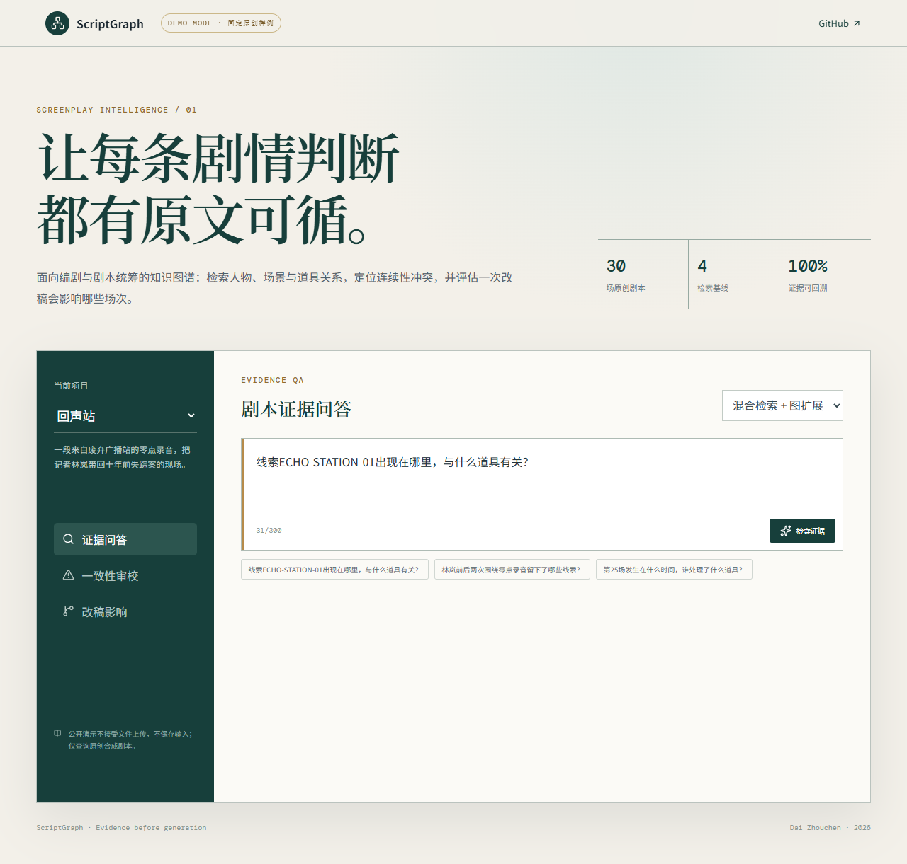
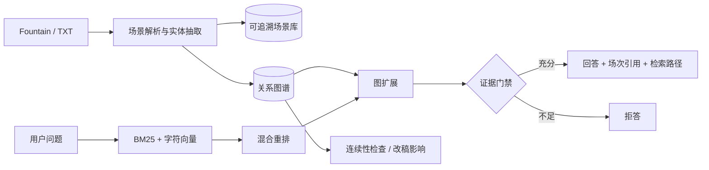

# ScriptGraph

> 剧本知识图谱与可追溯 RAG · Evidence-grounded GraphRAG for screenplay continuity

[在线固定样例 Demo](https://daizhouchen.github.io/scriptgraph-rag/) · [30 秒操作视频](docs/assets/demo.webm) · [产品说明](docs/product.md) · [架构说明](docs/architecture.md)



ScriptGraph 将人物、场景、道具、事件与版本组织成可追溯图谱，支持带场次引用的问答、一致性审校和改稿影响分析。系统在证据不足时拒答，不使用模型常识补写剧本事实；抽取结果保留原文行号与人工复核状态。

## 为什么做这个项目

长剧本的事实分散在几十甚至上百场中。一次人物设定或道具归属的修改，可能影响前后多处场次。单纯向量检索容易漏掉跨场关系，也难以说明“为什么这个场次会受影响”。ScriptGraph 用关键词、字符向量与图关系共同检索，并把最终结论和传播路径落回原文。

## 当前能力

- 解析 Fountain/TXT，提取场次、人物、地点、道具、事件、事实与来源位置。
- 提供 BM25、确定性字符向量、混合检索、图扩展四组可复现基线。
- 输出人物/道具关联证据、事件顺序、一致性候选和改稿影响路径。
- FastAPI 提供 `/api/projects`、`/api/query`、`/api/consistency/check`、`/api/impact`。
- React/Vite 固定语料 Demo 不接收文件上传，不保存用户输入；本地完整模式可导入自有剧本。
- 4 个原创中文合成剧本，共 120 场；180 条固定问答与 48 处可控冲突。

## 系统架构



## 可复现结果

以下结果来自固定合成集，**尚待作者逐条人工复核，状态为 provisional**。它们用于检查工程机制，不代表真实剧组效率提升。

| 方法 | 单场 Recall@5 | 多跳 Recall@5 | 时序 Recall@5 | Citation P@1 | 无答案拒答率 |
|---|---:|---:|---:|---:|---:|
| BM25 | 1.000 | 0.883 | 1.000 | 0.980 | 1.000 |
| 字符向量 | 0.683 | 0.792 | 0.000 | 0.466 | 1.000 |
| 混合检索 | 1.000 | 0.858 | 1.000 | 0.980 | 1.000 |
| 混合检索 + 图扩展 | 1.000 | **1.000** | 1.000 | **0.953** | 1.000 |

图扩展在多跳 Recall@5 上较字符向量基线提升 20.83 个百分点。48 个注入冲突在当前合成集上的检测 F1 为 1.000；完整明细见 [`reports/baseline.json`](reports/baseline.json)。

## 一条命令启动

```bash
docker compose up --build
```

打开 `http://localhost:8000`。不使用 Docker 时：

```bash
uv sync --extra dev
uv run python -m scriptgraph.data --output data
uv run uvicorn scriptgraph.api:app --reload
```

另一个终端：

```bash
cd web
npm ci
npm run dev
```

## 测试与评测

```bash
uv run pytest -q
uv run ruff check .
uv run python -m scriptgraph.eval --data data --output reports/baseline.json
python scripts/review_dataset.py --kind questions --reviewer YOUR_NAME
python scripts/review_dataset.py --kind conflicts --reviewer YOUR_NAME
```

`review_dataset.py` 会断点保存人工复核结论；在全部关键样本复核完成前，README 与简历不得把 provisional 指标写成正式结果。

## 数据与边界

公开仓库只包含原创合成剧本，不包含公司内部资料、商业剧本或未授权内容。当前“向量”基线使用确定性中文字符 n-gram 表示，确保零密钥复现；完整本地模式预留 sentence-transformers/FAISS 与 Neo4j 适配器。更多信息见 [`data/README.md`](data/README.md)。

## English summary

ScriptGraph is an evidence-grounded GraphRAG prototype for screenplay QA, continuity review and revision-impact tracing. Every fact is linked to screenplay lines; unsupported questions are refused. The public demo uses a fixed, fully synthetic Chinese corpus and performs no uploads.

## License

Code is licensed under Apache-2.0. Generated sample screenplays and evaluation data are released under CC BY 4.0.
