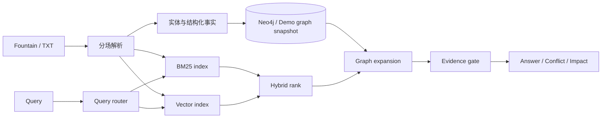

# 架构说明

```mermaid
flowchart LR
  A[Fountain / TXT] --> B[分场解析]
  B --> C[实体与结构化事实]
  C --> D[(Neo4j / Demo graph snapshot)]
  B --> E[BM25 index]
  B --> F[Vector index]
  Q[Query] --> R[Query router]
  R --> E
  R --> F
  E --> H[Hybrid rank]
  F --> H
  D --> G[Graph expansion]
  H --> G
  G --> V[Evidence gate]
  V --> O[Answer / Conflict / Impact]
```

公开 Demo 使用固定图快照，避免免费托管环境依赖外部数据库。本地 Docker Compose 提供 Neo4j 服务。检索和评测由项目自身实现，不把框架默认结果当作实验结论。

