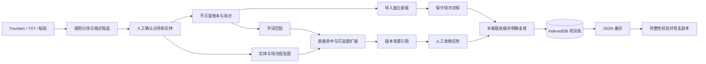
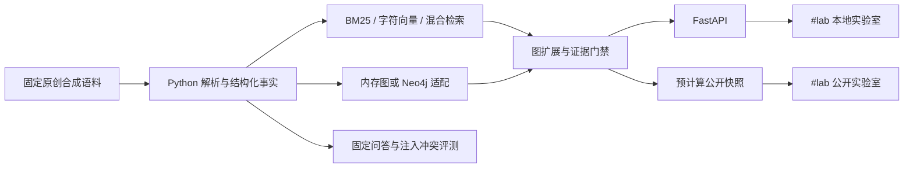

# 架构说明

ScriptGraph 有两个明确入口：默认的浏览器本机改稿工作台，以及 `#lab` 技术实验室。前者处理用户项目；后者保留 Python / FastAPI / Neo4j 与固定合成语料实验，两者没有自动传送用户项目的连接。

## 主工作台的数据路径



图表示业务流，保存并不限于最后一步：创建项目、确认索引、编辑任务和导入版本都会更新同一份本机项目库。关系和对照结果从项目数据计算，不依赖远程图数据库。

| 模块 | 职责 |
|---|---|
| [App.tsx](../web/src/App.tsx) | 默认显示工作台；进入 `#lab` 时加载旧实验室 |
| [Workbench.tsx](../web/src/Workbench.tsx) | 项目库、当前项目、保存状态、备份恢复与界面调度 |
| [ProjectViews.tsx](../web/src/ProjectViews.tsx) | 原文与关系、检索、改稿任务、版本复查四个工作视图 |
| [dialogs.tsx](../web/src/dialogs.tsx) | 导入预览、不可漂移的来源查看和任务复核表单 |
| [domain.ts](../web/src/domain.ts) | 分场、图构建、检索、引用验证、版本对照、任务约束和备份校验 |
| [project-store.ts](../web/src/project-store.ts) | IndexedDB 读取、完整性检查与串行保存 |
| [sample-project.ts](../web/src/sample-project.ts) | 可编辑原创教学项目及明确标为人工审阅的示例任务 |

## 原文与引用模型

项目 `Project` 保存多个 `ScriptVersion`、实体索引 `Entity` 和改稿任务 `ReviewIssue`。每次导入创建新的版本 ID 和场次 ID，`activeVersionId` 指向最新导入的工作稿。版本比较选择不会修改这个指针。

导入仅移除开头 BOM，并将 CRLF / CR 统一成 LF；不清理缩进、段落内部空白或尾部空行。行号以规范化后的文本为准。标准标题页保存在版本全文中，场次之外只允许可识别标题页或空白；其他前置文字也需要纳入待确认场次。

`EvidenceRef` 由以下字段组成：

```ts
{ versionId, sceneId, lineStart, lineEnd, quote }
```

`makeEvidence` 要求行号落在指定版本的同一场次内；`resolveEvidence` 从该版本重新读取文本，检查摘录逐字一致。来源不合法时返回失败，而不是根据新稿场号寻找近似内容。因此插场、删场、调序和别名调整都不会悄悄改指旧引用。

这里的不可变性指应用不覆盖已保存稿本、引用不随新稿漂移；它不是数字签名、第三方公证或对本机数据库的加密保护。项目可以删除，任务也可以由用户明确移除引用。

## 解析、实体与真实图检索

解析器识别中文及 Fountain 场头，允许用严格递增的起始行人工覆盖分场。无场头时保留全文为一个待确认场次；空文本、NUL、超限或非法边界阻止导入。字符与行的连续覆盖在恢复时再次验证。

实体候选仅来自文本格式：`@姓名`、对白角色行、显式道具标记和可能需要人工排除的独行短中文。候选携带来源行与原因，不带「已理解剧情」状态。只有最终确认的实体进入图。标准名称与别名的冲突被拒绝，以免同一名称默默连接到两个对象。

`buildGraph` 在选定版本逐行寻找已确认名称及别名，生成实体—场次边和提及行引用。它不生成角色间关系、持有者、知情状态或事件因果边。界面图显示前六个关联场次，下方列表保留全部关联。

`queryProject` 的两种方式都真实处理当前项目原文：

1. 将查询按空白拆成词；直接结果要求所有词在同一场出现。中文为子串匹配，拉丁标识符检查字词边界；也支持当前版本的「第 N 场」定位。
2. `text` 方式只返回直接命中；`graph` 方式在此基础上，沿命中场次中的已确认实体扩展到其他提及场次。
3. 图扩展结果保留「起点场次 → 实体 → 目标场次」与目标原文引用，并与直接结果分开标记。
4. 没有直接命中时停止，不从关系图凭空补结果。界面当前最多展示 16 项，底层接口可限制返回数量。

这是确定性的字词及实体—场次检索，没有 BM25 排名、语义向量、LLM 重排或答案生成。不能用技术实验室的 GraphRAG 指标描述它。

## 新稿对照与任务复核

`diffVersions` 先按唯一规范化内容配对，再按唯一规范化场头配对。比较键忽略场序标记、场头格式和整体首尾空白；版本保存的原文不被改动。重复或无法唯一对应的场次单列为 `ambiguous`，不按场号强行配对。

已配对场次之间出现相对顺序反转才计为 `moved`；插场引起的编号整体后移不算调序。剩余项标记新增或删除，同时提示可能是改名造成的无法配对。界面展示两侧完整原文，不声称完成了剧情语义 diff 或逐字修订标注。

任务处理状态与版本复核分别保存：

- `status`：待处理、修改中、已解决或保留设定。
- `createdVersionId`：任务创建时的工作稿。
- `reviewedVersionId`：最近一次有有效依据支持的稿本复核记录；无依据的草稿任务为 `null`。
- `evidence`：可同时包含历史稿与当前稿的引用。

导入新版后，`reviewedVersionId !== activeVersionId` 的任务进入待复核队列，原处理状态不变。这是保守的版本提醒，不是自动冲突检测。一般编辑只更新任务；`reviewIssue` 必须附上目标稿本至少一处非空有效引用，才记录这一轮复核。没有来源不能标为已解决；移除该次复核版本的全部非空依据后，会清除相应复核声明。

## IndexedDB 与备份恢复

项目库保存在 IndexedDB 的 `scriptgraph-projects` 数据库，包含项目集合及选中项目 ID。工作台修改在内存中即时生效，再延迟 300 ms 合并保存；存储层克隆快照并串行写入，以事务完成作为保存成功的依据。页面用更新代次避免较早写入结果覆盖较新修改的保存状态。

存储层另用 `storageRevision` 防止多标签页互相覆盖：加载时记录预期版本，在同一读写事务中比较当前记录；版本不同则终止事务并返回 `StorageConflictError`。页面提示先备份本页修改，再明确放弃未保存状态并重新载入。这是冲突保护，不是跨页面自动合并或多人协作。

读取时逐个项目执行 `validateBackup`。读取失败、损坏或版本不兼容时显示错误，不创建空项目库覆盖旧数据。写入失败时保留内存中的修改、提供重试和项目备份；页面离开前仍有脏数据会尝试触发浏览器提醒。这不保证浏览器被强制关闭时的数据安全。

项目备份格式为：

```json
{
  "format": "scriptgraph-project",
  "schemaVersion": 2,
  "project": {}
}
```

校验包含字段形状、版本和场次 ID 唯一性、活动稿本存在性、时间范围、原文与场次完整覆盖、名称／别名冲突、引用行号与摘录一致性，以及复核记录的原文依据。未知字段不会直接混入项目对象。失败返回错误且不导入；成功后 `cloneProject` 为项目分配新 ID，保留版本、场次、任务及其内部引用，作为独立副本加入项目库。

当前输入保护包括每份文本 200 万字符、每版 2000 场、每项目 30 版／500 项实体／1000 项任务、版本正文累计 800 万字符。界面文件读取限制为 6 MB，恢复文件限制为 24 MB，项目库最多 30 项。这些是边界约束，不是已经验证的容量或性能承诺。

## #lab 技术实验室



旧接口 `/api/projects`、`/api/projects/{id}/workspace`、`/api/query`、`/api/consistency/check` 和 `/api/impact` 保留。公开构建设置 `VITE_STATIC_DEMO=true`，实验室样例查询读取同源预计算快照，自由输入只做关键词候选查找；本地未设置该变量时连接 FastAPI。这个开关不改变主工作台的本机执行方式。

Docker Compose 提供本地 API 与 Neo4j 服务。默认可复现的向量基线是确定性字符 n-gram；sentence-transformers / FAISS 为可选依赖，实际启用状态取决于本地配置。主工作台不调用这些组件，也不会把 IndexedDB 项目同步到实验室。

实验室评测与浏览器领域测试用途不同：前者检查固定合成语料中的检索、引用和注入冲突机制，仍标为 `provisional / pending_user_review`；后者检查导入、引用、diff、复核和备份等应用约束。任一测试通过，都不等于对真实剧本的理解或创作效果得到验证。

## 验证入口

- `web/tests/domain.test.mjs`：分场不丢文本、实体确认、真实关系扩展、历史引用、保守 diff、任务复核与损坏备份拒绝。
- `npm test` / `npm run build`：在 `web/` 执行领域测试及前端编译。
- `uv run pytest -q` / `uv run ruff check .`：在仓库根目录检查原 Python 实验路径。
- [产品验收流程](product.md#完成一轮可验收的改稿)：从导入或教学示例到新版复核、刷新保存与恢复副本，核对用户可见结果。
