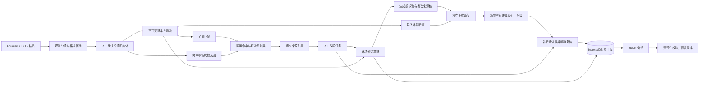
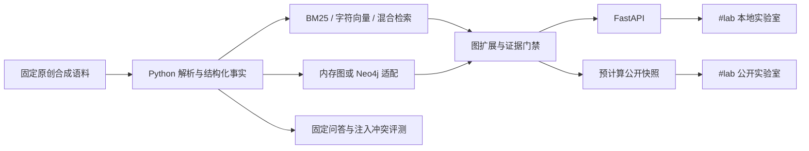

# 架构说明

ScriptGraph 有两个明确入口：默认的浏览器本机改稿工作台，以及 `#lab` 技术实验室。前者处理用户项目；后者保留 Python / FastAPI / Neo4j 与固定合成语料实验，两者没有自动传送用户项目的连接。

## 主工作台的数据路径


```mermaid
flowchart LR
  A[Fountain / TXT / 粘贴] --> B[规则分场与格式候选]
  B --> C[人工确认分场和实体]
  C --> D[不可变稿本与场次]
  D --> E[字词匹配]
  C --> F[实体与场次提及图]
  E --> G[直接命中与可选图扩展]
  F --> G
  G --> H[版本来源引用]
  H --> I[人工改稿任务]
  I --> W[逐场修订草稿]
  D --> W
  W --> V[生成前校验与场次来源链]
  V --> J[独立正式新版]
  D --> X[导入外部新版]
  X --> J
  J --> K[场次与行差异及引用分级]
  K --> L[补新版依据并明确复核]
  I --> L
  L --> M[(IndexedDB 项目库)]
  W --> M
  M --> N[JSON 备份]
  N --> O[完整性校验并恢复副本]
```

图表示业务流，保存并不限于最后一步：创建项目、维护索引、编辑任务、修改草稿与生成版本都会更新同一份本机项目库。草稿与正式稿是不同对象；关系、差异和分级从项目数据计算，不依赖远程图数据库。

| 模块 | 职责 |
|---|---|
| [App.tsx](../web/src/App.tsx) | 默认显示工作台；进入 `#lab` 时加载旧实验室 |
| [Workbench.tsx](../web/src/Workbench.tsx) | 项目库、当前项目、保存状态、备份恢复与界面调度 |
| [ProjectViews.tsx](../web/src/ProjectViews.tsx) | 原文与关系、真实文本检索及视图接口 |
| [EditorView.tsx](../web/src/EditorView.tsx) | 逐场草稿编辑、关联材料、增删调序、生成前预览 |
| [ReviewViews.tsx](../web/src/ReviewViews.tsx) | 任务分组、正式版本比较与报告导出 |
| [RevisionTools.tsx](../web/src/RevisionTools.tsx) | 精确行选择与逐行差异展示 |
| [dialogs.tsx](../web/src/dialogs.tsx) | 导入预览、历史来源查看、旧新依据并列复核 |
| [domain.ts](../web/src/domain.ts) | 分场、草稿、来源链、图检索、引用约束、版本对照与备份校验 |
| [revision-analysis.ts](../web/src/revision-analysis.ts) | 有预算行差异、引用映射、任务影响分级与当前状态报告 |
| [project-store.ts](../web/src/project-store.ts) | schema 兼容、IndexedDB 完整性读取与防覆盖保存 |
| [sample-project.ts](../web/src/sample-project.ts) | 可编辑原创教学项目及明确标为人工审阅的示例任务 |

## 原文与引用模型

schema 3 的 `Project` 保存多个 `ScriptVersion`、实体索引 `Entity`、改稿任务 `ReviewIssue` 和可选 `WorkingDraft`。每次导入或生成正式稿创建独立版本 ID 和场次 ID，`activeVersionId` 指向该正式稿。草稿保存及版本比较选择不会修改这个指针。

导入仅移除开头 BOM，并将 CRLF / CR 统一成 LF；不清理缩进、段落内部空白或尾部空行。行号以规范化后的文本为准。标准标题页保存在版本全文中，场次之外只允许可识别标题页或空白；其他前置文字也需要纳入待确认场次。

`EvidenceRef` 由以下字段组成：

```ts
{ versionId, sceneId, lineStart, lineEnd, quote }
```

`makeEvidence` 要求行号落在指定版本的同一场次内；`resolveEvidence` 从该版本重新读取文本，检查摘录逐字一致。来源不合法时返回失败，而不是根据新稿场号寻找近似内容。因此插场、删场、调序和别名调整都不会悄悄改指旧引用。

`EvidencePicker` 通过行号点击、Shift 范围扩展或起止行输入调用 `makeEvidence`。它按实际行段切片，不用 `indexOf(quote)` 搜索第一处相同对白；越界、倒置范围或纯空白不能直接作为建任务的依据。选择器只能引用正式稿，草稿行号尚未成为正式来源。

这里的不可变性指应用不覆盖已保存稿本、引用不随新稿漂移；它不是数字签名、第三方公证或对本机数据库的加密保护。项目可以删除，任务也可以由用户明确移除引用。

## 草稿生命周期与来源链

`WorkingDraft` 包含 `baseVersionId`、名称、时间、原始前言 `preamble`、草稿场次和可选 `lastEditedSceneId`。每个 `DraftScene` 有独立 ID、文字与 `sourceSceneId`；新增场次的来源为 `null`。草稿修改不覆盖 `ScriptVersion`，也不会把任务引用绑定到还在变化的正文。

`startDraft` 从当前正式稿建立单一草稿；再次调用返回已有草稿。`updateDraftScene`、`addDraftScene`、`removeDraftScene`、`moveDraftScene`、`renameDraft` 返回新的项目值，由同一保存队列持久化。最近编辑场供续写使用，不保存光标或编辑器撤销栈。`discardDraft` 仅移除草稿；界面确认后才调用。

`previewDraft` 按草稿顺序组装文本、保留原前言并计算行号。生成门槛包括基准仍为当前稿、至少一场、每场非空、一个可识别场头与非空正文，以及文本、场次和版本限制。已经导入并确认边界的来源场次若原样保留，沿用原场头与边界；非标准场头及未分场片段以警告提示。修改或新增场次仍须符合标准场头规则。正文与顺序完全未变不生成重复版本；同一编辑框出现多个场头要求拆成独立场次。草稿可以暂存尚未完成的文本，保存／恢复校验不要求它已经可发布。

`publishDraft` 再次检查预览后，一次返回新增正式版、切换 `activeVersionId` 且移除草稿的新项目；失败抛错，不提前清除原状态。新版记录 `parentVersionId = baseVersionId` 与 `sceneOrigins[newSceneId] = sourceSceneId`，新增场次不伪造来源。后续对照可沿更早版本追溯来源，改场头或调序不会仅因名称变化失去身份。外部 `addVersion` 不产生这条编辑链，有草稿时拒绝导入，防止基准悄悄改变。

## 解析、实体与真实图检索

解析器识别中文及 Fountain 场头，允许用严格递增的起始行人工覆盖分场。无场头时保留全文为一个待确认场次；空文本、NUL、超限或非法边界阻止导入。字符与行的连续覆盖在恢复时再次验证。

实体候选仅来自文本格式：`@姓名`、对白角色行、显式道具标记和可能需要人工排除的独行短中文。候选携带来源行与原因，不带「已理解剧情」状态。只有最终确认的实体进入图。标准名称与别名的冲突被拒绝，以免同一名称默默连接到两个对象。

`buildGraph` 在选定版本逐行寻找已确认名称及别名，生成实体—场次边和提及行引用。它不生成角色间关系、持有者、知情状态或事件因果边。界面图显示前六个关联场次，下方列表保留全部关联。

`queryProject` 的两种方式都真实处理当前项目原文：

1. 将查询按空白拆成词；直接结果要求所有词在同一场出现。中文为子串匹配，拉丁标识符检查字词边界；也支持当前版本的「第 N 场」定位。
2. `text` 方式只返回直接命中；`graph` 方式在此基础上，沿命中场次中的已确认实体扩展到其他提及场次。
3. 图扩展结果保留「起点场次 → 实体 → 目标场次」与目标原文引用，并与直接结果分开标记。
4. 没有直接命中时停止，不从关系图凭空补结果。界面当前最多展示 16 项，底层接口可限制返回数量。

这是确定性的字词及实体—场次检索，没有 BM25 排名、语义向量、LLM 重排或答案生成。不能用技术实验室的 GraphRAG 指标描述它。

## 新稿对照与任务复核

`diffVersions` 先沿 `parentVersionId`／`sceneOrigins` 建立明确对应，再对剩余场次按唯一规范化内容、唯一规范化场头配对。比较键忽略场序标记、场头格式和整体首尾空白；版本原文不被改动。没有明确来源且重复或无法唯一对应的场次单列为 `ambiguous`，不按场号强行配对。

已配对场次之间出现相对顺序反转才计为 `moved`；插场引起的编号整体后移不算调序。剩余项标记新增或删除，同时提示可能是改名造成的无法配对。歧义组分侧呈现原文，不假装已经形成确定的增删对应。

`diffLines(before, after, beforeStart, afterStart)` 返回含原始行号的 `same`／`added`／`removed` 行。先保留公共前后缀，中间采用最多 500,000 个单元格的确定性 LCS；超出预算时整块呈现前后稿。`truncated: true` 意味着精细匹配降级，不是裁掉原文：过滤增／删行可分别完整重建两稿，降级时统计不承诺最小编辑量。界面折叠未变化行是展示行为，可展开完整场次。这不是剧情语义 diff 或逐字红线修订。

`mapEvidence` 先校验原引用，复用明确的场次对应，再寻找完整行段的唯一精确匹配：

- 唯一对应整场文字完全相同时，保留引用相对行段；同场第二次重复对白仍定位第二次，不取首个同句。
- 引文未变而同场其他文字变化标为 `context`；相对调序或可靠的异处文字候选标为 `moved`。
- 原引文变化但仍有唯一对应场时，标为 `changed`，候选可为目标整场真实原文，不拼造原句。
- 无法找到对应标为 `missing`，重复或无法唯一确定标为 `ambiguous`；原依据无效为 `unanchored`。旧稿他场已存在的同句不能冒充本引用迁移。

候选始终经过真实版本与行段构造，只供人工采用，不更新旧 `EvidenceRef`。这些标签说明文字与位置关系，不推断剧情冲突、道具交接是否成立或创作效果。

任务处理状态与版本复核分别保存：

- `status`：待处理、修改中、已解决或保留设定。
- `createdVersionId`：任务创建时的工作稿。
- `reviewedVersionId`：最近一次有有效依据支持的稿本复核记录；无依据待办为 `null`。
- `evidence`：可同时包含历史稿与当前稿的引用。

`issueImpact` 只取 `reviewedVersionId` 对应的有效引用组；没有该组时，取最新有有效引用的版本组。历史累积引用不重复参与当前影响判断。当前稿已有有效引用与复核记录才返回 `reviewed`；依据未变但还未确认新稿的任务返回 `unchanged`，不能自动算通过。界面把变化、歧义或无依据任务优先列出，其他场次的无关改动不提高引用未变任务的优先级。

生成或导入新版后，`reviewedVersionId !== activeVersionId` 的任务仍待人工确认，原处理状态不变。一般编辑只更新任务；`reviewIssue` 必须附上目标稿本至少一处非空有效引用，才记录复核。没有来源不能标为已解决；移除该次复核版本的全部非空依据后，会清除相应复核声明。

## 报告是比较与当前状态快照

`exportRevisionReport(project, fromId, toId)` 仅接受已保存正式版本，导出所选版本的场次标题、行增删、对应歧义和任务引用。任务按目标稿的 `issueImpact` 分为未复核、已有目标稿复核记录和无有效依据待办；所有任务仍包含当前处理状态及备注。报告不读取 `project.draft`，也不会把当前「已解决」说成本轮才解决。

模型没有事件日志，只保存当前任务状态、最近有效复核版本和更新时间。因此不能从报告重建每轮完成列表、操作者或完整历史。任务页的另一个导出入口明确导出全部任务，不受列表筛选影响；JSON 备份才用于完整恢复。

## IndexedDB、迁移与备份恢复

项目库保存在 IndexedDB 的 `scriptgraph-projects` 数据库（数据库版本 1）、`workspace` store、原有 `library-v2` key；库内容和项目格式为 schema 3。保留同一个 key 以支持原位兼容与统一修订号。项目集合、当前项目 ID、正式版本与草稿一起保存。修改在内存中即时生效，再延迟 300 ms 合并保存；存储层克隆快照并串行写入，以事务完成作为成功依据。页面用更新代次避免旧写入结果覆盖新修改的保存状态。

存储层另用 `storageRevision` 防止多标签页互相覆盖：加载时记录预期版本，在同一读写事务中比较当前记录；版本不同则终止事务并返回 `StorageConflictError`。页面提示先备份本页修改，再明确放弃未保存状态并重新载入。这是冲突保护，不是跨页面自动合并或多人协作。

读取接受 schema 2／3 项目库，逐个通过 `validateBackup` 后返回 schema 3 对象，原项目、版本、场次、任务 ID 与原文引用均保留；schema 2 不伪造草稿或来源链，旧库没有 `storageRevision` 时从 0 处理。后续成功写入才将同一记录保存为 schema 3。已有上一版客户端读取新 schema 会拒绝；升级前已打开、仍拿旧快照的上一版客户端则因保存修订号不一致而停止写入，避免覆盖新记录。此保护针对现有支持修订号校验的客户端，不等于对任意脚本写入本机数据库的隔离。

读取时逐个项目执行 `validateBackup`。读取失败、损坏或版本不兼容时显示错误，不创建空项目库覆盖旧数据。写入失败时保留内存中的修改、提供重试和项目备份；页面离开前仍有脏数据会尝试触发浏览器提醒。这不保证浏览器被强制关闭时的数据安全。

项目备份格式为：

```json
{
  "format": "scriptgraph-project",
  "schemaVersion": 3,
  "project": {}
}
```

上面的空对象仅表示封装位置；实际 `project` 必须是完整项目。封装与内部 schema 必须一致，schema 2 与 3 都可校验。校验包含 ID 唯一性、活动稿、时间、原文连续覆盖、名称／别名、引用行段与摘录，以及复核记录依据。来源链只允许指向更早的项目内版本，拒绝循环、跨项目和重复来源映射；草稿校验基准、前言、场次来源、文字和续写位置。损坏字段不能静默丢弃，schema 2 也不能夹带 schema 3 草稿或来源链。

未知字段不会直接混入项目对象。失败返回错误且不导入；成功后 `cloneProject` 只为项目库身份分配新 ID，保留内部版本、场次、草稿、任务和引用，作为独立副本加入库。手动恢复创建副本，与已有项目库原位迁移是两条不同路径。

当前输入保护包括每份文本及草稿总文 200 万字符、每版／草稿 2000 场、每项目 30 版／500 项实体／1000 项任务、正式版本正文累计 800 万字符，项目库最多 30 项。剧本文件读取限制为 6 MB。备份采用 `serializeBackup` 的紧凑 JSON，字符上限为 2400 万；文件读取上限为 72 MB，避免把中文 UTF-8 字节数误当成字符数，读取后仍须通过字符与结构校验。这些是边界约束，不是已经验证的容量或性能承诺。

## #lab 技术实验室


```mermaid
flowchart LR
  S[固定原创合成语料] --> P[Python 解析与结构化事实]
  P --> R[BM25 / 字符向量 / 混合检索]
  P --> G[内存图或 Neo4j 适配]
  R --> X[图扩展与证据门禁]
  G --> X
  X --> API[FastAPI]
  X --> SNAP[预计算公开快照]
  API --> LAB[#lab 本地实验室]
  SNAP --> PUB[#lab 公开实验室]
  P --> EVAL[固定问答与注入冲突评测]
```

旧接口 `/api/projects`、`/api/projects/{id}/workspace`、`/api/query`、`/api/consistency/check` 和 `/api/impact` 保留。公开构建设置 `VITE_STATIC_DEMO=true`，实验室样例查询读取同源预计算快照，自由输入只做关键词候选查找；本地未设置该变量时连接 FastAPI。这个开关不改变主工作台的本机执行方式。

Docker Compose 提供本地 API 与 Neo4j 服务。默认可复现的向量基线是确定性字符 n-gram；sentence-transformers / FAISS 为可选依赖，实际启用状态取决于本地配置。主工作台不调用这些组件，也不会把 IndexedDB 项目同步到实验室。

实验室评测与浏览器领域测试用途不同：前者检查固定合成语料中的检索、引用和注入冲突机制，仍标为 `provisional / pending_user_review`；后者检查导入、引用、diff、复核和备份等应用约束。任一测试通过，都不等于对真实剧本的理解或创作效果得到验证。

## 验证入口

- `web/tests/domain.test.mjs`：分场、实体、真实图扩展、历史引用与基础完整性约束。
- `web/tests/revision-analysis.test.mjs`：精确行对照、重复引用、无关变更、调序、引用分级、长文降级与报告范围。
- `web/tests/draft.test.mjs`：增删调序、生成校验、来源链、schema 2 兼容与草稿备份恢复。
- `npm test` / `npm run build`：在 `web/` 执行领域测试及前端编译。
- `uv run pytest -q` / `uv run ruff check .`：在仓库根目录检查原 Python 实验路径。
- [产品验收流程](product.md#完成一轮可验收的改稿)：导入与精确选证、草稿续写、生成新稿、按变化复核、报告和备份恢复。
